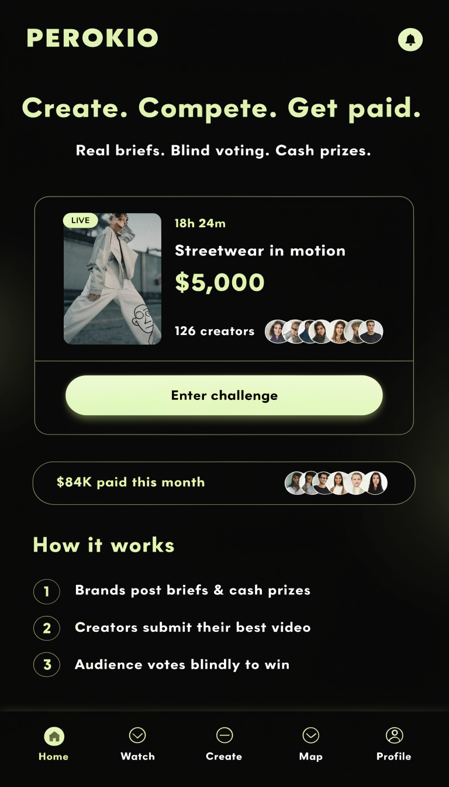

# Perokio — système UI/UX v2

**Auteur : Manus AI**  
**Statut : spécification d’implémentation**  
**Portée : `apps/web`**

Perokio est une place de marché sociale de compétitions créatives. Son interface doit donner la priorité à quatre signaux : **ce qui est en jeu**, **ce qui se passe maintenant**, **ce que l’utilisateur peut faire ensuite** et **pourquoi il peut faire confiance au système**. La direction retenue conserve l’identité « electric night » déjà présente, mais remplace les surfaces vides et les styles ponctuels par une grammaire mobile-first cohérente.

## 1. Principes d’expérience

| Principe | Règle produit | Conséquence UI |
|---|---|---|
| Stakes first | L’argent et l’urgence motivent l’entrée | Une valeur display par écran : cagnotte, gain, compteur ou résultat |
| Media first | Une compétition créative se juge visuellement | Les défis, votes et résultats utilisent une vraie surface média avant le texte secondaire |
| Trust at the decision | La confiance est nécessaire au moment d’entrer, financer ou retirer | Escrow, paiement à l’heure et ventilation des gains restent proches du CTA concerné |
| One next action | Chaque état doit proposer une suite claire | Un CTA principal maximum par section et un état vide « quoi, pourquoi, ensuite » |
| Progress feels earned | Vote, niveau, streak et rally doivent montrer ce qui a changé | Barres de progression, verdicts courts, succès visibles et transitions brèves |
| Focus when judging | Le vote est l’interaction centrale | Navigation globale masquée pendant le deck, contenu dominant, confirmation explicite |

## 2. Direction artistique

L’univers visuel repose sur un fond presque noir, des surfaces charbon et un citron très clair. Le citron ne doit pas devenir une lueur décorative omniprésente : il indique une **action**, un **progrès**, une **valeur positive** ou un **état actif**. Les couleurs sémantiques restent indépendantes de la marque.

| Jeton | Valeur | Usage |
|---|---:|---|
| `--bg` | `#080906` | Fond principal |
| `--surface-1` | `#10110c` | Carte standard |
| `--surface-2` | `#171912` | Carte élevée ou contrôle |
| `--surface-3` | `#202319` | Survol, sélection secondaire |
| `--fg` | `#f4f7e4` | Texte principal |
| `--muted` | `#a5a890` | Texte secondaire lisible |
| `--subtle` | `#71745f` | Métadonnées et légendes |
| `--border` | `#292c20` | Séparation standard |
| `--accent` | `#cfff3d` | CTA, progression et état actif |
| `--accent-soft` | `#e9ff96` | Valeur display et surfaces lumineuses |
| `--success` | `#43d17a` | Paiement, validation et progression positive |
| `--warning` | `#f2b84b` | Délai ou action à surveiller |
| `--danger` | `#ff5d66` | Échec, élimination ou action destructive |
| `--info` | `#68a9ff` | Information neutre |

Les ombres sont rares et diffuses. Une carte se distingue d’abord par son contraste de surface et sa bordure, non par une accumulation de glow. Les rayons suivent quatre valeurs : `10px`, `14px`, `20px` et `999px`.

## 3. Typographie et densité

La typographie utilise la pile locale `Geist`, `Inter`, puis les polices système. Les titres sont compacts, avec une graisse forte et un interlettrage légèrement négatif. Les nombres utilisent des chiffres tabulaires.

| Niveau | Taille fluide | Usage |
|---|---:|---|
| Display | `clamp(2.4rem, 8vw, 4.5rem)` | Une valeur ou promesse principale |
| Hero | `clamp(2rem, 6vw, 3.5rem)` | Accroche marketing ou titre de défi |
| Titre de page | `clamp(1.75rem, 4vw, 2.5rem)` | Titre unique de la vue |
| Titre de section | `1.125rem` | Groupe de contenu |
| Corps | `1rem` | Texte courant |
| Petit | `0.875rem` | Métadonnées |
| Légende | `0.75rem` | Badge et aide courte |

La largeur de lecture standard est de `760px`. Les surfaces média et analytiques peuvent s’étendre jusqu’à `1180px` sur desktop. Le contenu mobile conserve `16px` de marge ; les grands écrans utilisent une gouttière fluide de `24px` à `40px`.

## 4. Navigation

### Mobile

La navigation basse contient cinq destinations : **Home**, **Watch**, **Create**, **Map** et **Profile**. `Create` est contextuel : il mène vers la création d’une Story pour une marque et vers les défis ouverts pour un créateur. La destination active utilise un fond citron doux ou une icône citron, mais jamais une simple variation de graisse difficile à percevoir.

### Desktop

La barre latérale reste compacte et réservée aux surfaces authentifiées. La landing publique et les pages de vote focalisées n’utilisent pas la barre latérale. Le contenu desktop ne doit pas rester enfermé dans une colonne mobile vide : listes, analytics et admin passent à des grilles adaptées.

### Mode focus

Les routes de vote peuvent demander au shell de masquer la navigation globale. Elles fournissent toujours un bouton retour, le statut de la manche et une aide contextuelle.

## 5. Composants partagés

| Composant | Spécification |
|---|---|
| `PageHeader` | Eyebrow facultatif, titre, description courte et zone d’actions ; se replie proprement sur mobile |
| `SectionHeader` | Titre, résumé facultatif et lien/action secondaire |
| `Button` | Variantes primary, secondary, ghost et danger ; hauteur minimale 48px ; état actif `scale(.97)` |
| `IconButton` | 44×44px minimum, libellé accessible obligatoire |
| `Card` | Variantes standard, interactive, media, accent et inset ; aucun style inline de couleur |
| `ChallengeCard` | Média, badge live, marque, titre, cagnotte, délai, participants et confiance |
| `MetricCard` | Libellé, valeur, verdict et contexte ; une seule carte display par écran |
| `Progress` | Valeur accessible, libellé courant et prochaine étape |
| `EmptyState` | Icône, titre, explication, CTA éventuel et alternative publique si nécessaire |
| `Notice` | Variantes info, success, warning, danger ; remplace les messages texte isolés |
| `Skeleton` | Formes compatibles avec le contenu final, sans bloquer toute la page |
| `Sheet` | Détail ou confirmation mobile ; en-tête fixe, contenu scrollable, footer CTA optionnel |
| `SegmentedControl` | Deux à quatre choix exclusifs, libellé accessible, défilement horizontal si nécessaire |
| `AvatarStack` | Preuve sociale compacte, limite visuelle et compteur restant |

## 6. Modèles d’écran

### Landing

La landing affiche la promesse **Create. Compete. Get paid.**, une compétition mise en avant, une preuve de gains et un parcours en trois étapes. L’invite d’installation PWA ne doit apparaître qu’après engagement et ne doit jamais recouvrir le CTA principal.

### Catalogue de défis

La page présente une recherche, des filtres rapides et des cartes média. Le montant constitue le premier signal de chaque carte ; délai, participants, zone géographique et confiance de la marque suivent. En cas d’indisponibilité de l’API, la page rend un état d’erreur actionnable au lieu d’une zone vide.

### Détail de défi

L’ordre est fixe : média et cagnotte, statut, confiance, brief, critères, gains, manches, puis outils propres au rôle. Les actions de marque et de créateur ne partagent pas le même bloc. Le financement utilise une divulgation progressive : total, explication de l’escrow, puis ventilation.

### Vote

Le deck expose le progrès avant le contenu. Chaque soumission fournit au minimum un média, une durée et une légende. L’identité reste masquée. Le choix est impossible avant trois secondes de visionnage et la sélection demande une confirmation. Si le contrat API ne fournit pas encore le média, l’interface montre un état bloqué honnête et non un faux contenu.

### Profil et wallet

Le profil commence par l’identité, le gain principal et la progression. Le rally et le referral sont visuellement séparés et expliqués en une phrase chacun. Le wallet sépare l’argent réel des pièces cosmétiques par un contrôle segmenté, avec l’argent réel sélectionné par défaut.

### Marque, analytics et admin

Les surfaces de gestion favorisent les décisions. Un KPI principal ouvre l’écran, suivi des indicateurs, de l’argent et de la prochaine action. L’admin utilise une navigation opérationnelle différente de la navigation sociale et conserve toujours le contexte de la vue précédente.

## 7. États et messages

Chaque appel asynchrone doit avoir quatre sorties visuelles. Le chargement utilise des squelettes, l’état vide explique l’absence, l’erreur explique la conséquence et permet de réessayer, et le succès confirme ce qui a changé. Les erreurs techniques, noms de fournisseurs non configurés ou détails de variables d’environnement ne sont jamais exposés à l’utilisateur.

| Situation | Formulation attendue |
|---|---|
| API indisponible | « Impossible de charger les défis pour le moment. Réessayer. » |
| Aucun défi live | « Aucun défi en direct. Les nouveaux briefs apparaîtront ici dès leur financement. » |
| Upload échoué | « L’envoi n’a pas abouti. Votre brouillon est conservé ; réessayez. » |
| Paiement confirmé | « Cagnotte sécurisée. Le défi peut maintenant ouvrir ses candidatures. » |
| Vote enregistré | « Choix enregistré. Il vous reste 3 votes pour déverrouiller votre résultat. » |

## 8. Responsive et accessibilité

Les contrôles interactifs mesurent au moins 44px, les focus restent visibles, le texte secondaire respecte un contraste lisible, et la couleur ne constitue jamais l’unique signal. Les animations durent de 120 à 240ms, ne modifient que `transform` et `opacity` lorsque possible, et respectent `prefers-reduced-motion`. Les zones fixes tiennent compte de `env(safe-area-inset-bottom)`.

Les cartes média passent d’une colonne mobile à deux colonnes sur tablette puis à trois colonnes uniquement lorsque la densité de données le permet. Les formulaires restent sur une colonne ; les dashboards utilisent une grille de douze colonnes sur desktop. Aucun écran ne doit se limiter à une colonne de `720px` centrée lorsqu’il dispose de données naturellement comparables.

## 9. Sources internes de référence

Cette spécification synthétise l’audit réel de `apps/web`, le prototype de 37 écrans, le design system existant et six références Higgsfield créées pour la refonte. Les images de référence se trouvent dans `docs/ui-reference/` et servent de cible d’ambiance ; les composants réels, la copie validée et les contraintes d’API du dépôt priment toujours.
