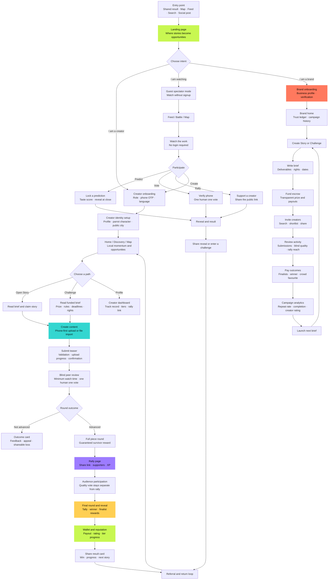
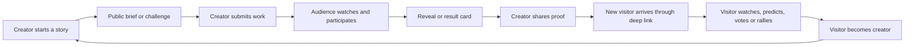

# Perokio — User Flow and UX Experience

## Product promise

> **Where stories become opportunities.**

Perokio is designed as a three-sided experience. **Creators** make stories and build a public track record. **Spectators** watch, judge, predict and rally around moments without being forced to become creators. **Brands** create briefs, fund opportunities and discover work through transparent performance and trust signals.

The core activation action is:

> **Start your story.**

The experience should always make three things obvious: what is happening now, what the user can do next, and what the user receives in return. Perokio should feel energetic and social, but its money, voting, rights and privacy states must remain explicit.

## Complete product flow

## Experience by audience

| Audience | First promise | Primary journey | Main reward | Return trigger |
|---|---|---|---|---|
| Creator | Your story can become an opportunity. | Onboard → build identity → claim → submit → advance → rally → earn → share. | Money, reputation, creative proof and a stronger public profile. | New brief, tier progress, result reveal, payout or rival activity. |
| Spectator | Your call can help decide what moves next. | Arrive → watch → vote or predict → see reveal → share. | Taste score, early access, social participation and a path into creation. | Countdown, reveal, prediction result, creator rally or local momentum. |
| Brand | See craft before reach. | Brief → fund → invite → review → reward → measure. | Original content, transparent performance and trusted creator relationships. | Campaign analytics, creator ratings and next brief creation. |

## What the user experiences at each stage

| Stage | What the user must understand | Interface response | Intended feeling | Failure to avoid |
|---|---|---|---|---|
| Entry | Why Perokio is different from a normal feed or marketplace. | Strong story-led landing, live opportunity, visible proof and one primary CTA. | Curious and invited. | A generic social-media landing with too many equal actions. |
| Role selection | The product adapts to the user’s intent. | Creator, Brand and Just watching cards with plain-language benefits. | In control. | Forcing every visitor to register before seeing value. |
| Identity | A recognizable profile helps a creator build momentum. | Character Creator, profile image import, public city and shareable profile. | Ownership and self-expression. | Treating the avatar as decoration with no connection to the public profile. |
| Discovery | There is a relevant opportunity nearby or worth following. | Campaign cards, Stories, Mapbox intent filters and local momentum. | Possibility. | Empty grids, unclear deadlines or location exposure without consent. |
| Brief | The work, rules, rights, reward and deadline are clear. | Structured brief with requirements, funded status, payout breakdown and rights copy. | Confidence. | Hiding important rules below the CTA or using vague opportunity language. |
| Creation | The user can make a good submission without wasting effort. | Phone-first upload, teaser-first progression, local validation and resumable progress. | Momentum. | Upload errors that lose work or expose provider jargon. |
| Voting | The vote is fair, legible and not easily gamed. | Blind pairwise deck, minimum watch time, verification state and clear progress. | Focus and trust. | Mixing rally popularity with the quality score. |
| Rally | Sharing helps the creator without buying the quality result. | Personal deep link, ready-made share asset, supporters count and separate score labels. | Agency and social energy. | Suggesting that more money or followers can buy the prize. |
| Outcome | The user knows what happened and where the money is. | Verified result ticket, payout state, finalist reward, appeal route and share action. | Closure, pride or constructive recovery. | Ambiguous results, hidden payout states or shame-based loss screens. |
| Return | There is a meaningful next action. | Next brief, tier progress, local activity, new reveal or referral status. | Continuity. | Notifications without an actionable reason to return. |

## Core viral loop

The loop is healthy only when every step delivers value on its own. A visitor should be able to watch before signing up. A spectator should have a meaningful prediction or voting action. A creator should receive a fair opportunity even without a large audience. A result card should be worth sharing because it communicates identity and proof, not because it hides an uncomfortable outcome.

## Key UX principles

**One next action.** Each screen should have one dominant CTA. Secondary actions may exist, but they should not compete with the primary journey.

**Proof before hype.** Perokio can be energetic, but claims about money, ratings, votes, campaign completion and payout status must be labeled as verified, pending, declared or estimated.

**Separate quality from momentum.** Blind quality voting decides the creative result. Rally activity creates participation, XP and crowd-favourite energy. The two systems must remain visibly separate.

**Let visitors sample the product.** Public feeds, Battles, Results and map discovery should show value before registration. Registration should unlock participation, not merely remove an arbitrary wall.

**Make the social object portable.** Every meaningful outcome should produce a compact share object: a win, an advance, a close loss, a prediction result, a streak or a creator profile milestone.

**Use motion to explain state.** Motion should signal arrival, progress, reveal and confirmation. It should not make money, voting or privacy interactions harder to understand. Reduced-motion users must receive the same information without animation.

**Protect user dignity.** A loss is a state in the journey, not a public humiliation. The interface should give the user a constructive next step: appeal, claim a stipend, improve the profile or enter the next story.

## Recommended review sequence

Review the product in this order: landing and role selection, public deep-link arrival, creator onboarding, identity and Character Creator, discovery and Mapbox, brief and submission, blind voting, rally, outcome and wallet, then brand campaign creation and analytics. This sequence follows the emotional and commercial funnel from curiosity to repeated participation.
